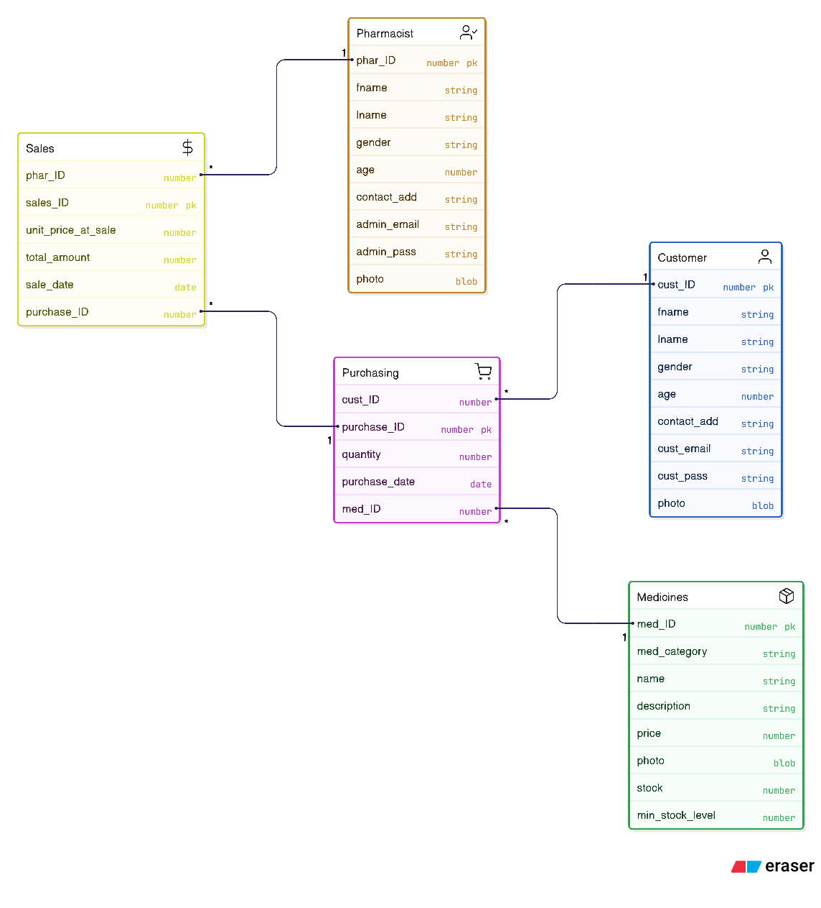

 # PharmacySystem

 ## Setup

 ### Step 1
 Install [Oracle-Database](https://www.oracle.com/database/free/get-started/#free-platforms)
 and install [SQL-Developer](https://www.oracle.com/database/sqldeveloper/technologies/download/)

 ---

 ### Step 2
 Connect to Database as SYSTEM
 Username: `system` 
 Password: "your prefer passwords" 
 Host: `localhost` 
 Port: `1521` 
 SID: `free` 

 ---

 ### Step 3
 Create user Name must be `C##PHARMACYSYSTEM`
 Grant permission to as System.

 CREATE USER C##PHARMACYSYSTEM IDENTIFIED BY YourPassword;
 GRANT CONNECT, RESOURCE, DBA TO C##PHARMACYSYSTEM;
 GRANT UNLIMITED TABLESPACE TO C##PHARMACYSYSTEM;

 ---

 ### Step 4
 Run SQL Script to make Database [PharmacySystem.sql](https://github.com/Sun-Sarun/PharmacySystem/blob/main/database/PharmacySystem.sql)
 Then run view SQL Script to create view [AllViews.sql](https://github.com/Sun-Sarun/PharmacySystem/tree/main/database/View/AllViews.sql)

 ---

 ### Step 5
 Run test data script [Generated_Data.sql](https://github.com/Sun-Sarun/PharmacySystem/blob/main/database/Data/Generated_Data.sql)

# References
[ER Diagram for Pharmacy Management System](https://itsourcecode.com/uml/pharmacy-management-system-er-diagram/)
---
# ERD

